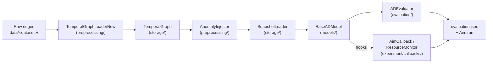

# DyGADBench — Dynamic Graph Anomaly Detection Benchmark

DyGADBench is a research benchmark for evaluating anomaly detection algorithms on temporal (dynamic) graphs. Given a sequence of graph snapshots, the benchmark injects synthetic anomalies at controlled rates and durations, runs one or more detection methods, and reports edge-level ROC-AUC and average precision. The distinguishing property of DGADB is that anomaly injection, training, and evaluation are fully parameterized through configuration files, so every reported number is reproducible by re-running the same command with the same config.

## Installation

[pixi](https://pixi.sh) is required. It manages the conda and pip dependency stack and avoids version conflicts that arise when installing PyTorch Geometric and its optional dependencies by hand.

```bash
git clone <repo-url> dgadb
cd dgadb
pixi install
pixi run aim-init   # initialise the local Aim repo (.aim/) — required, see below
pixi shell
```

The `aim-init` step creates a `.aim/` repository in the project root. The training loop's `AimCallback` writes to this repository on every run; if `.aim/` is not present, the runner crashes the first time a callback fires. You only need to run `aim-init` once per fresh clone.

### GPU support

The default `pixi install` resolves the CPU-only PyTorch wheel. To get a CUDA-enabled environment, install the `cuda` feature:

```bash
pixi install -e cuda
```

Then run any `dgadb` command via `pixi run -e cuda ...` and pass `--device gpu` where the subcommand accepts it:

```bash
pixi run -e cuda dgadb run --method gcn --datasets bitcoin-alpha \
    --epochs 5 --device gpu --concurrency 1
pixi run -e cuda dgadb scalability --methods gcn --datasets bitcoin-alpha \
    --epochs 1 --device gpu --output-dir benchmark-results/smoke
```

The `cuda` feature is Linux-only and pulls in `cuda-version=12.*`; macOS users stay on the default CPU environment.

### Apptainer (older Linux servers)

**On older Linux servers** where installing pixi is impractical (old libc or gcc), an [Apptainer](https://apptainer.org/) image is available. Build it with:

```bash
apptainer build container/dgadb.sif container/dgadb.def
```

and run experiments via `./container/run-dgadb.sh`. See [`container/README.md`](container/README.md) for details.

## Quickstart

Download the Bitcoin-Alpha dataset, then run a five-epoch GCN experiment:

```bash
uv run scripts/bitcoin.py   # downloads bitcoin-alpha and bitcoin-otc
```

The dataset download scripts use [PEP 723](https://peps.python.org/pep-0723/)
inline metadata, so they run via `uv run` rather than `pixi run`. There is
no separate setup — pixi installs `uv` as part of the base environment.

```bash
pixi run dgadb run --method gcn --datasets bitcoin-alpha \
  --experiment-name quickstart --anom-types random --anom-rates 0.1 \
  --anom-durations small --epochs 5 --concurrency 1
```

The run completes in under two minutes on a laptop CPU. Results are written to:

```
experiment-results/quickstart/gcn/<variant>/evaluation.json
```

Open `evaluation.json` and look for `"roc_auc"` in the `summary` block. A value above 0.5 confirms the pipeline ran end-to-end correctly. Experiment metrics are also tracked in [Aim](https://aimstack.io/); launch the UI with:

```bash
pixi run aim   # opens http://localhost:43800
```

## Architecture Overview

Data flows left-to-right through five stages: a raw edge list is loaded into a `TemporalGraph`, anomalies are injected into the val/test splits, the result is iterated as a sequence of snapshots, each model consumes those snapshots through a uniform interface, and an evaluator computes the final metrics while training-loop callbacks emit telemetry along the way.



The five stages, in code:

- **Storage** (`src/dgadb/storage/`) — defines `TemporalGraph` and `TemporalGraphSnapshot`, the core data structures used throughout the rest of the package.
- **Preprocessing** (`src/dgadb/preprocessing/`) — normalises raw edge lists and splits them into train/val/test via `TemporalGraphLoaderNew`. The `_New` suffix marks the current iteration of classes that superseded earlier versions during development.
- **Anomaly injection** (`src/dgadb/preprocessing/anomaly_injection.py`) — `AnomalyInjector` inserts synthetic anomalous edges into the val/test splits at the rate and duration specified by the config (one of `random / burst / clique / path / bridge`).
- **Models** (`src/dgadb/models/`) — every method inherits from `BaseADModel` (`src/dgadb/models/base.py`) and implements the five-method contract: `setup(data)`, `_train_step(snapshot) -> float`, `_predict(snapshot) -> Tensor`, `save(dir)`, and `load(dir)`. Current model adapters live in `*_new/` subdirectories; legacy adapters in their non-`_new` siblings exist only for historical reference and are not wired into the runner.
- **Experiment runner and evaluator** (`src/dgadb/experiment/runner.py`, `src/dgadb/evaluation/evaluator.py`) — `ExperimentRunner` orchestrates training and dispatches events to a list of callbacks (`AimCallback`, `ResourceMonitor`, `TuneReporter`) at six hook points (`on_train_begin/end`, `on_train_epoch_begin/end`, `on_train_step_begin/end`); `ADEvaluator` consumes the trained model's per-edge scores on the test split and produces the final ROC-AUC and average precision. Hyperparameter tuning is driven separately by `src/dgadb/experiment/tune.py`, which wraps `ExperimentRunner` in Ray Tune trials — see the [Hyperparameter tuning](#hyperparameter-tuning) section below.

A browsable HTML API reference for every public class and function is generated by [pdoc](https://pdoc.dev/) from the in-source docstrings:

```bash
pixi run -e dev docs          # render to docs/api/
pixi run -e dev docs-serve    # render and serve at http://localhost:8080
```

The output is gitignored. The build script lives at `scripts/build_docs.py`.

## Adding a New Dataset

1. Download the raw edge list and place it under `data/<dataset-name>/`.
2. Write a download script under `scripts/` following the pattern in `scripts/bitcoin.py`.
3. Create a dataset config at `configs/datasets/<dataset-name>.yaml`. Copy `configs/datasets/bitcoin-alpha.yaml` as a starting point; set `dataset.name` and adjust the `pipeline.steps` parameters (split ratios, directionality, etc.) as needed.
4. Verify the dataset loads by running the quickstart command with `--datasets <dataset-name>` and any method.
5. Add the download step to the `download-data` task in `pyproject.toml` if the dataset should be part of the full download sweep.

## Adding a New Method

1. Create a directory `src/dgadb/models/<MethodName>_new/`.
2. In that directory, implement a class that inherits from `BaseADModel` (defined in `src/dgadb/models/base.py`). You must implement `setup(data)`, `_train_step(snapshot)`, `_predict(snapshot)`, `save(save_dir)`, and `load(load_dir)`. See `src/dgadb/models/sad_new/sad.py` for a minimal example.
3. Register the method in the method registry used by the runner. Follow the pattern for an existing method in `src/dgadb/experiment/runner.py`.
4. Smoke-test with: `pixi run dgadb run --method <methodname> --datasets bitcoin-alpha --epochs 1 --concurrency 1`.

## Hyperparameter tuning

Hyperparameter tuning is supported through `src/dgadb/experiment/tune.py` and is implemented with [Ray Tune](https://docs.ray.io/en/latest/tune/index.html). Hyperparameters are tuned per method and per dataset, following the protocol used in the paper:

1. Initialize from the hyperparameters recommended in the original paper of each method.
2. Refine them with random search.
3. Select the best configuration by validation ROC-AUC.
4. Use a fixed one-day budget per method–dataset pair.

This means tuning is performed independently for each method–dataset pair rather than once globally, and the selected configuration is then used for the final experiment run.

*Note: due to compute constraints, the published results apply the full protocol (steps 1–4) to a subset of **datasets** rather than to the full method × dataset matrix. On the tuned datasets, every method went through the protocol; on the remaining datasets, every method uses only step 1 — the hyperparameters recommended in its original paper. `tune.py` and the search spaces from Appendix A.3 (Table 4 in the paper) can be re-run on any cell to extend the tuned subset.*

## Reproducing the Paper's Experiments

All dataset configs are in `configs/datasets/` and experiment configs in `configs/experiments/`. The hyperparameters used by the loop below are the configurations selected by the [Hyperparameter tuning](#hyperparameter-tuning) protocol — the tuned winners on the datasets that went through the protocol, the original-paper defaults on the rest. The runner takes a single method per invocation, so reproducing the full evaluation grid is a shell loop over the ten methods:

```bash
for method in sad taddy slade strgnn rustgraph gcn gat graphsage generaldyg addgraph; do
    pixi run dgadb run --method "$method" \
        --datasets bitcoin-alpha bitcoin-otc email-dnc uc-social digg-homo as-topology \
        --anom-types random burst clique path bridge \
        --anom-rates 0.01 0.05 0.1 \
        --anom-durations small medium large \
        --epochs 50 --concurrency 4
done
```

The valid `--anom-types` are `random / burst / clique / path / bridge`; valid `--anom-durations` are `small / medium / large`. See `src/dgadb/preprocessing/anomaly_injection.py` for the implementation of each strategy.

## Smoke testing

Before merging or shipping a refactor, run the per-method × per-dataset smoke test:

```bash
./scripts/smoke_test.sh --device gpu     # gpu
./scripts/smoke_test.sh --device cpu     # cpu
```

This runs `dgadb run` once per method on a small baseline dataset and once per dataset using the fastest baseline method, producing a TSV summary under `benchmark-results/smoke/`. See [`scripts/README.md`](scripts/README.md) for details.

## Scalability benchmark

The streaming-scalability appendix from the paper — referred to throughout the codebase as **Tier A** — reports per-(method, dataset) wall-clock training time, peak GPU/RAM, edge throughput, and per-snapshot latency percentiles for every cell of the main evaluation grid. The table is dispatched one cell at a time so a single failure (out-of-memory, timeout, missing data) doesn't cascade to the rest of the sweep.

A single cell uses the `scalability` subcommand:

```bash
pixi run dgadb scalability --methods gcn --datasets bitcoin-alpha --epochs 1 --device cpu \
  --output-dir benchmark-results/smoke
```

The full Tier A grid is dispatched by:

```bash
./scripts/run_scalability_sweep.sh
```

After the sweep, generate the LaTeX table and figures with `scripts/analyze_streaming_scalability.py` (see the script's `--help` for subcommand options: `tier-a-table`, `latency-cdf`, `cost-curve`).

## Supplementary materials

The [`supplementary-materials/`](supplementary-materials/) directory ships the per-dataset numerical results and sensitivity-analysis figures referenced in the paper:

- **`tables/<method>.csv`** — full per-(dataset, anom_type, R, T) ROC-AUC and AUPRC for each of the ten methods, complementing the aggregated Table 3.
- **`plots/{rocauc,auprc}/exp_{1,2}_*.pdf`** — twenty sensitivity plots covering the injection-rate (R) and temporal-span (T) sweeps for both metrics.
- **`browse.py`** — an interactive [marimo](https://marimo.io) notebook to scan the tables and plots: filterable results, head-to-head leaderboards, per-method heatmaps, and an embedded PDF viewer.

```bash
pixi run -e dev marimo edit supplementary-materials/browse.py     # editable
pixi run -e dev marimo run  supplementary-materials/browse.py     # read-only
```

See [`supplementary-materials/README.md`](supplementary-materials/README.md) for the column schema and dataset statistics.

## License

This project is released under the MIT License. See [`LICENSE`](LICENSE) for the full text.
