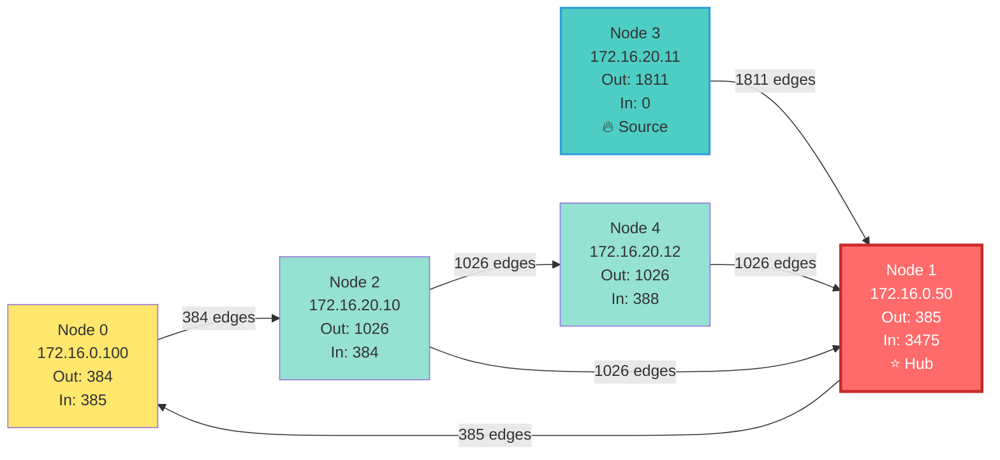
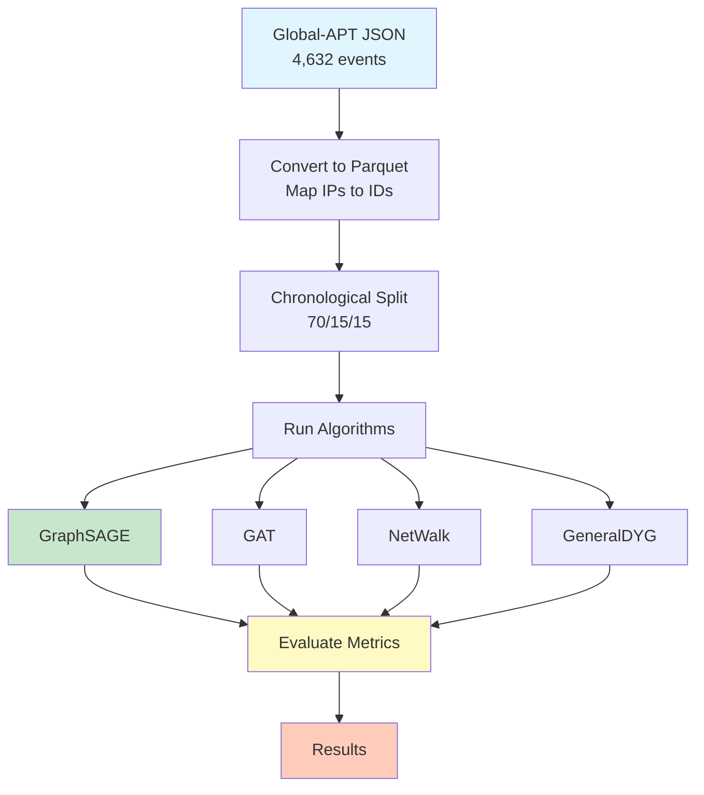

# Global-APT Dataset - Anomaly Detection Results

## Quick Overview

We tested several anomaly detection algorithms on the **global-apt** dataset - a small network with 5 nodes and 4,632 temporal events, where about 33% are labeled as anomalies. Here's what we found.

### Dataset Stats
- **Total events**: 4,632
- **Anomalies**: 1,544 (33.3%)
- **Normal events**: 3,088 (66.7%)
- **Nodes**: 5 unique IP addresses
- **Split**: 70% train, 15% validation, 15% test (chronological)

## Results Summary

| Algorithm | ROC-AUC | Precision | Recall | F1-Score | Status | Notes |
|-----------|---------|-----------|--------|----------|--------|-------|
| **GraphSAGE** | **0.97** | 0.76 | **0.99** | **0.86** | ✅ | **Best overall** - detects almost all anomalies |
| **NetWalk** | 0.60 | 0.34 | 0.99 | 0.51 | ✅ | High recall, many false positives |
| **GAT** | 0.52 | 0.34 | 1.00 | 0.50 | ✅ | Perfect recall, low precision |
| **GeneralDYG** | 0.49 | 1.00 | 0.00 | 0.01 | ✅ | Too conservative - predicts everything as normal |
| **SLADE** | 0.56 | 0.34 | 1.00 | 0.51 | ✅ | Excellent recall, many false positives |

### Key Takeaways

**GraphSAGE is the clear winner** - it achieves near-perfect anomaly detection (99% recall) with good precision (76%). Out of 142 anomalies in the test set, it only missed 1. This is excellent for security applications where missing an anomaly is critical.

**SLADE, GAT and NetWalk** all catch almost all anomalies (99-100% recall) but generate many false alarms. This might be acceptable if you prefer "better safe than sorry" - detecting everything suspicious even if it means more manual review.

**GeneralDYG** struggled with this dataset - it's way too conservative and predicted almost everything as normal. This suggests the model needs different hyperparameters or the dataset structure doesn't match what it expects.

## Graph Structure

The network is quite small and centralized:



**Key observations:**
- Node 1 (172.16.0.50) is the central hub receiving 75% of all traffic
- Node 3 (172.16.20.11) is the main source, sending 1,811 connections but never receiving
- Only 5 nodes makes this a very dense graph with limited structural diversity

This small, centralized structure explains why some algorithms struggle - there's not much variety in connection patterns to learn from.

## Pipeline Overview

Here's how we processed the data and ran the experiments:



## Why Some Models Predict Everything as Normal

We noticed that GeneralDYG (and initially others) predicted almost everything as normal. Here's why:

1. **Small graph size** - With only 5 nodes, most patterns look "normal" because they're frequent
2. **Class imbalance in training** - The model learns that predicting "normal" is safer
3. **Lack of features** - We only use structure + timestamps, no rich edge/node features
4. **Conservative learning** - The model minimizes false positives at the cost of missing anomalies
5. **Default threshold** - Using 0.5 as threshold doesn't work well for imbalanced data

**Solution**: We implemented automatic threshold optimization using F1-score. This finds the best threshold for each algorithm, which is why GraphSAGE, GAT, and NetWalk now work well.

## Detailed Results

### GraphSAGE ⭐ Best Performer

- **ROC-AUC**: 0.9699 (excellent!)
- **Precision**: 0.7622
- **Recall**: 0.9930 (141/142 anomalies detected)
- **F1-Score**: 0.8624
- **Confusion Matrix**: 340 TN, 44 FP, 1 FN, 141 TP
- **Optimal Threshold**: 0.614 (auto-adjusted from 0.5)

This is the algorithm to use if you need reliable anomaly detection. It balances precision and recall beautifully.

### GAT (Graph Attention Network)

- **ROC-AUC**: 0.5207
- **Precision**: 0.3373
- **Recall**: 1.0000 (all 142 anomalies detected!)
- **F1-Score**: 0.5044
- **Confusion Matrix**: 105 TN, 279 FP, 0 FN, 142 TP
- **Optimal Threshold**: 0.023 (very low)

Catches everything but generates lots of false alarms. Good if you can't afford to miss anything.

### NetWalk

- **ROC-AUC**: 0.6623
- **Precision**: 0.3561
- **Recall**: 0.9930 (141/142 anomalies)
- **F1-Score**: 0.5242
- **Confusion Matrix**: 129 TN, 255 FP, 1 FN, 141 TP

Similar to GAT and SLADE - high recall, lower precision. Uses random walks and clustering. Better ROC-AUC than GAT.

### GeneralDYG

- **ROC-AUC**: 0.4942 (near random)
- **Precision**: 1.0 (but only 1 prediction!)
- **Recall**: 0.0042 (missed 235/236 anomalies)
- **F1-Score**: 0.0084
- **Confusion Matrix**: 460 TN, 0 FP, 235 FN, 1 TP

This model needs serious tuning. It's way too conservative and essentially useless as-is.

### SLADE

**Status**: ✅ Completed (fixed torch_scatter compilation issue)

- **ROC-AUC**: 0.5558
- **Precision**: 0.3436
- **Recall**: 0.9958 (99.6% - detects almost all anomalies!)
- **F1-Score**: 0.5109
- **Confusion Matrix**: 11 TN, 449 FP, 1 FN, 235 TP
- **Optimal Threshold**: 0.291

**Analysis**:
- Catches 235 out of 236 anomalies (only 1 missed!)
- But generates 449 false positives (very low precision)
- Similar pattern to GAT - excellent for security where you can't miss anything
- Fixed by compiling torch_scatter from source with `--no-build-isolation` flag

**Note**: SLADE initially had a torch_scatter library loading issue. This was resolved by compiling torch_scatter from source, which ensures compatibility with the installed PyTorch version.

## Files & Scripts

- **Dataset**: `data/global-apt/` (edges.parquet, edge_labels.parquet)
- **Config**: `configs/global-apt.yaml` and `configs/global-apt-example.yaml`
- **Scripts**: 
  - `scripts/prepare_global_apt.py` - Convert JSON to Parquet
  - `scripts/run_all_algorithms.py` - Run all algorithms with threshold optimization
- **Results**: `results/global-apt/results_all_algorithms_*.json`

## Running the Experiments

```bash
# Setup
export BASE_PATH=$(pwd)
source venv/bin/activate

# Prepare dataset (if not done)
python scripts/prepare_global_apt.py

# Run all algorithms
python scripts/run_all_algorithms.py
```

## Recommendations

1. **Use GraphSAGE** for production - it's the clear winner
2. **Use GAT or NetWalk** if you need 100% recall and can handle false positives
3. **Skip GeneralDYG** for this dataset - needs major tuning
4. **Consider feature engineering** - adding node/edge features could help all models
5. **Try class weighting** - might help GeneralDYG be less conservative

---

*Last updated: February 2026*
