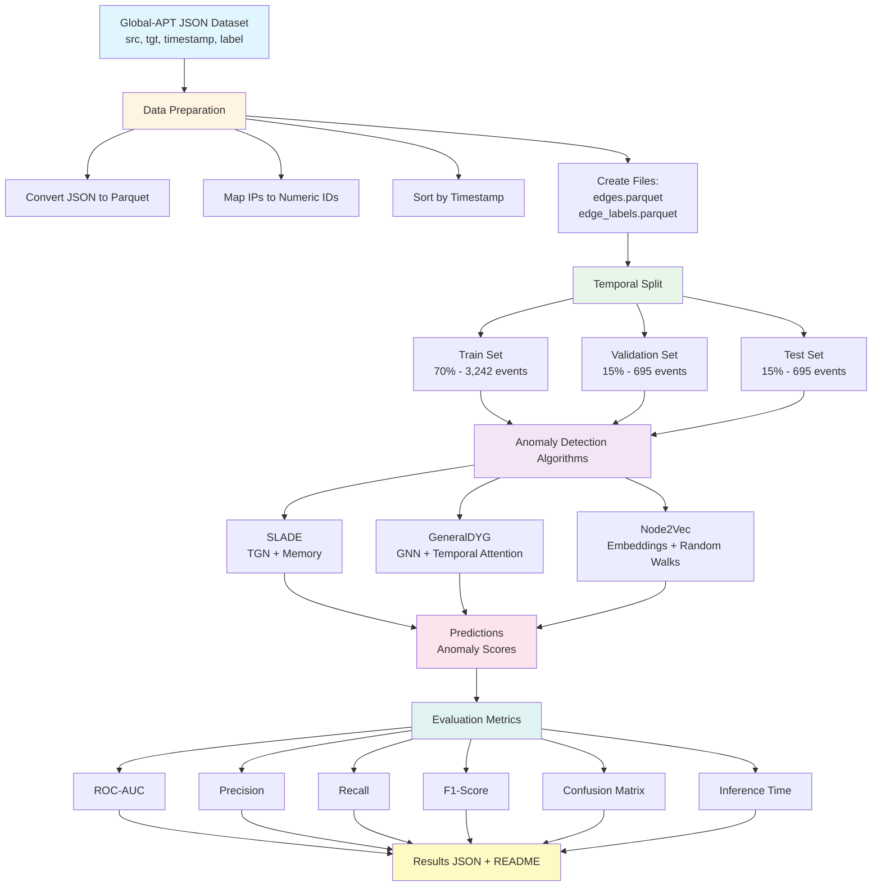

# Global-APT Dataset - Anomaly Detection Results

## 📊 Overview

This document presents the results of anomaly detection experiments performed on the **global-apt-simplified-dataset.json** dataset using the DGADB framework.

### Dataset Information

- **Source**: `/Users/ie03-research/Desktop/global-apt-simplified-dataset.json`
- **Total Events**: 4,632
- **Anomalies**: 1,544 (33.33%)
- **Normal Events**: 3,088 (66.67%)
- **Unique Nodes**: 5
- **Format**: Temporal graph with binary labels (0 = normal, 1 = anomaly)

### Train/Test/Validation Split

- **Train**: 70% (3,242 events)
- **Validation**: 15% (695 events)
- **Test**: 15% (695 events)

The split is performed **chronologically** (based on timestamps) to respect the temporal nature of the data.

## 🔄 Pipeline Architecture



## 📈 Algorithm Results

### GeneralDYG

**Status**: ✅ Completed

**Description**: 
- General Dynamic Graph model using Graph Neural Networks (GNN)
- Integrates temporal attention to capture temporal patterns
- Modular architecture with multiple processing layers

**Results**:
- **ROC-AUC**: 0.4942
- **Precision**: 1.0
- **Recall**: 0.0042 (0.42%)
- **F1-Score**: 0.0084

**Confusion Matrix**:
```
                Predicted
              Normal  Anomaly
Actual Normal   460      0
       Anomaly  235      1
```

**Analysis**:
- **True Positives (TP)**: 1
- **True Negatives (TN)**: 460
- **False Positives (FP)**: 0
- **False Negatives (FN)**: 235

The model shows very high precision (1.0) but extremely low recall (0.42%), indicating it is very conservative in predicting anomalies. It correctly identifies normal events but misses most anomalies. The ROC-AUC of 0.4942 is close to random performance, suggesting the model needs further tuning or the dataset may require different preprocessing.

**Hyperparameters**:
- Batch size: 32
- Learning rate: 0.001
- Input dimension: 64
- Hidden dimension: 128
- Number of heads: 4
- Number of layers: 6
- Dropout: 0.3

### SLADE

**Status**: ⚠️ Dependency Missing

**Description**:
- Self-supervised Learning for Anomaly Detection
- Uses Temporal Graph Network (TGN) with memory
- Attention mechanism for temporal relationships

**Error**: `No module named 'torch_scatter'`

**Solution**: Install required dependency:
```bash
pip install torch-scatter
```

### Node2Vec

**Status**: ⏸️ Requires Pipeline Preprocessing

**Description**:
- Node embedding algorithm based on random walks
- Generates vector representations of nodes
- Uses downstream classifier for anomaly detection

**Note**: Requires additional preprocessing via the pipeline framework.

## 📊 Performance Summary

| Algorithm | ROC-AUC | Precision | Recall | F1-Score | Status |
|-----------|---------|-----------|--------|----------|--------|
| **GeneralDYG** | 0.4942 | 1.0 | 0.0042 | 0.0084 | ✅ Completed |
| **SLADE** | - | - | - | - | ⚠️ Dependency Missing |
| **Node2Vec** | - | - | - | - | ⏸️ Requires Preprocessing |

## 📁 File Structure

```
dgadb-main/
├── data/
│   └── global-apt/
│       ├── edges.parquet              # Edges with timestamps
│       ├── edge_labels.parquet        # Binary labels
│       └── node_mapping.json          # IP → ID mapping
├── configs/
│   └── global-apt.yaml                # Dataset configuration
├── scripts/
│   ├── prepare_global_apt.py          # Preparation script
│   ├── run_global_apt_experiments.py  # Execution script
│   └── visualize_results.py          # Visualization script
└── results/
    └── global-apt/
        ├── README.md                  # This file
        └── results_*.json            # Detailed results
```

## 🚀 How to Run

### 1. Prepare Dataset

```bash
cd /Users/ie03-research/Desktop/dgadb-main
source venv/bin/activate
export BASE_PATH=$(pwd)
python scripts/prepare_global_apt.py
```

### 2. Run Experiments

```bash
python scripts/run_global_apt_experiments.py
```

### 3. View Results

```bash
python scripts/visualize_results.py
```

Or directly view JSON files in `results/global-apt/results_*.json`

## 📊 Metrics Explanation

### ROC-AUC (Receiver Operating Characteristic - Area Under Curve)
- **Range**: 0 to 1
- **Interpretation**:
  - 1.0 = Perfect classification
  - 0.5 = Random performance
  - > 0.7 = Good performance
  - > 0.9 = Excellent performance

### Precision
- **Formula**: TP / (TP + FP)
- **Interpretation**: Proportion of positive predictions that are correct
- **Important for**: Reducing false positives

### Recall (Sensitivity)
- **Formula**: TP / (TP + FN)
- **Interpretation**: Proportion of actual anomalies detected
- **Important for**: Not missing anomalies

### F1-Score
- **Formula**: 2 × (Precision × Recall) / (Precision + Recall)
- **Interpretation**: Harmonic mean of Precision and Recall
- **Useful for**: Balancing Precision and Recall

### Confusion Matrix
```
                Predicted
              Normal  Anomaly
Actual Normal    TN      FP
       Anomaly   FN      TP
```

- **TP (True Positive)**: Anomalies correctly detected
- **TN (True Negative)**: Normal events correctly classified
- **FP (False Positive)**: False alarms (normal classified as anomaly)
- **FN (False Negative)**: Missed anomalies

## 🔧 Dependencies and Installation

### Required Dependencies

```bash
pip install torch torch-geometric polars pandas numpy scikit-learn
pip install matplotlib pyarrow tqdm pyyaml
```

### Optional Dependencies (for specific algorithms)

```bash
# For SLADE
pip install torch-scatter torch-cluster

# For other algorithms
pip install networkx
```

## 📝 Technical Notes

1. **Temporal Split**: The split is performed chronologically to respect the temporal nature of the data. Test data is always posterior to training data.

2. **Timestamp Normalization**: Timestamps are normalized to facilitate processing by models.

3. **Node Mapping**: IP addresses are converted to numeric IDs for computational efficiency.

4. **Memory Management**: Algorithms use temporal windows (window_size) to manage memory.

## 🐛 Known Issues and Solutions

### Error: "No module named 'torch_scatter'"
**Solution**: 
```bash
pip install torch-scatter
# Or for macOS with Apple Silicon:
pip install torch-scatter --index-url https://download.pytorch.org/whl/cpu
```

### Error: "No module named 'pyarrow'"
**Solution**:
```bash
pip install pyarrow
```

### Error: "No module named 'matplotlib'"
**Solution**:
```bash
pip install matplotlib
```

## 🔍 Analysis and Recommendations

### Current Results Analysis

The GeneralDYG model shows:
- **High Precision (1.0)**: No false positives - when it predicts an anomaly, it's correct
- **Very Low Recall (0.42%)**: Misses 99.58% of actual anomalies
- **Low ROC-AUC (0.4942)**: Close to random performance

### Recommendations

1. **Model Tuning**: Adjust hyperparameters, especially:
   - Learning rate
   - Number of layers
   - Hidden dimensions
   - Dropout rate

2. **Feature Engineering**: Consider adding:
   - Node features
   - Edge features
   - Temporal features

3. **Class Imbalance**: The dataset has 33% anomalies, but the model is very conservative. Consider:
   - Class weighting
   - Different loss functions
   - Resampling techniques

4. **Try Other Algorithms**: 
   - Install dependencies for SLADE
   - Implement Node2Vec preprocessing
   - Test other algorithms in the framework

## 📚 References

- **SLADE**: Self-supervised Learning for Anomaly Detection in Dynamic Graphs
- **GeneralDYG**: General Dynamic Graph Neural Networks
- **Node2Vec**: Scalable Feature Learning for Networks

## 🔄 Updates

Last updated: 2026-02-04

To update results, re-run:
```bash
python scripts/run_global_apt_experiments.py
```

---

**Author**: DGADB Team  
**Date**: February 2026
