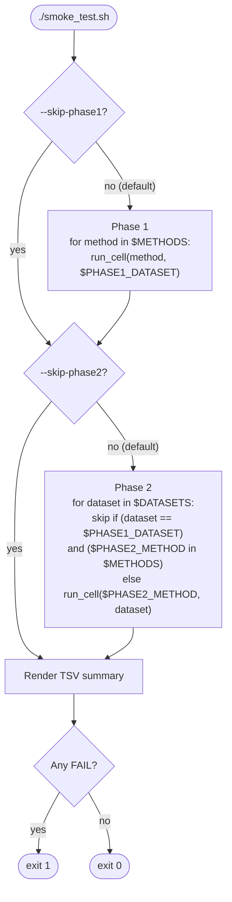

# Scripts

Helper scripts that sit alongside the `dgadb` package. They fall into three
categories:

1. **Dataset preparation** — one-shot downloaders for each dataset.
2. **Smoke testing** — sanity checks that exercise every method and every
   dataset after a refactor or merge.
3. **Scalability** — full per-(method, dataset) sweeps for the streaming-
   scalability appendix table (called *Tier A* throughout the codebase
   and in this README), plus the table/figure generator that consumes
   the sweep output.

All scripts work from a `pixi shell` (or via `pixi run -e dev <command>`).
The dataset downloaders use [PEP 723](https://peps.python.org/pep-0723/)
inline metadata and are launched via `uv run` (uv is installed by pixi).

---

## Dataset preparation

Each downloader is a self-contained script that fetches the raw files for
one dataset, normalises them into the parquet layout the loader expects,
and writes the result under `data/<dataset>/`. Run with:

```bash
uv run scripts/<dataset>.py
```

Set `DATA_PATH` if you want the data placed somewhere other than the
project root (e.g. `DATA_PATH=/mnt/disk2/dgadb uv run scripts/bitcoin.py`).

| Script | What it produces |
|---|---|
| `bitcoin.py` | bitcoin-alpha and bitcoin-otc trade graphs |
| `as-topology.py` | AS-Topology internet routing graph |
| `digg-homo.py` | Digg homogenous social graph |
| `email-dnc.py` | DNC email leak interaction graph |
| `enron.py` | Enron email graph |
| `epinions.py` | Epinions trust graph |
| `mooc.py` | MOOC student interaction graph |
| `reddit.py` | Reddit comment graph |
| `uc-social.py` | UC Irvine messaging graph |
| `wiki.py` | Wikipedia editor graph |
| `amazon.py` | Amazon review graph |
| `yelp-zip.py` | Yelp ZIP review graph |
| `dgraph.py` | DGraph financial-fraud graph (requires manual download of the source `.npz` first; see the script header) |
| `trace-theia.py` | Trace and Theia provenance graphs |

A bulk download is also exposed as a pixi task:

```bash
pixi run download-data    # runs every downloader except dgraph and trace-theia
```

---

## Smoke testing

### `smoke_test.sh` — two-phase end-to-end smoke

Runs `dgadb run` once per method on a small baseline dataset (phase 1)
and once per dataset using the fastest baseline method (phase 2). Catches
methods or dataset loaders that break after a refactor or merge in
roughly `num_methods + num_datasets - 1` cells, instead of the cartesian
product. Per-cell logs and a TSV results summary land under
`benchmark-results/smoke/<timestamp>_<device>/`.



```bash
./scripts/smoke_test.sh                                # cpu, full default
./scripts/smoke_test.sh --device gpu                   # gpu (cuda env)
./scripts/smoke_test.sh --methods "gcn gat" --skip-phase2
./scripts/smoke_test.sh --datasets "bitcoin-alpha bitcoin-otc" --skip-phase1
./scripts/smoke_test.sh --epochs 2 --timeout 900 --device gpu
```

Exit code is `0` only if every cell passes; `1` otherwise. See
`./scripts/smoke_test.sh --help` for the full list of options.

---

## Scalability sweeps

The scalability subcommand (`dgadb scalability`) measures, for one
(method, dataset) pair: wall-clock training time, peak GPU/RAM, edge
throughput, and per-snapshot streaming metrics (latency percentiles
plus throughput recomputed after a warmup window of leading snapshots
is discarded — that is, "warmup-excluded throughput"). The shell
wrappers below dispatch that subcommand across the full grid for the
streaming-scalability appendix table — the *Tier A* table; the name
shows up in script and directory names throughout this folder
(`run_scalability_sweep_tier1.sh`, `benchmark-results/tier_a/`, etc.).

### `run_scalability_sweep.sh` — full Tier A dispatch

The general-purpose driver. Iterates the cartesian product of `$METHODS`
and `$DATASETS`, skips cells listed in `KNOWN_OOM` (compute-bound or
memory-bound from §4.5 of the paper), launches each pair as a separate
process so a crash in one cell doesn't cascade, and records SUCCESS or
FAILED into `$OUTPUT_DIR/logs/<method>__<dataset>.log`. The script is
idempotent — already-completed pairs are detected by their log file and
skipped on re-run.

```bash
./scripts/run_scalability_sweep.sh \
    --epochs 3 --device gpu \
    --output-dir benchmark-results/tier_a \
    --timeout 1800
```

Run with `--help` for the full option list (`--methods`, `--datasets`,
`--outer dataset|method`, `--pixi-env`, etc.).

The Tier A grid is large enough that you typically split it into two
scheduling passes — `tier1` (every dataset except epinions) and
`tier2` (DGraph alone). These are subdivisions *within* Tier A driven
by per-cell wall-clock cost; they are not paper-level tiers.

### `run_scalability_sweep_tier1.sh` — Tier A pass 1 (everything except epinions)

Thin wrapper around `run_scalability_sweep.sh` that pins dataset-outer
ordering, a 30-minute per-pair timeout, and excludes `epinions` (which
is substantially larger than the other datasets and would dominate the
budget). Run this first under any time pressure — it guarantees a
complete Tier A table for every other dataset even if the overall
sweep is interrupted.

### `run_scalability_sweep_tier2.sh` — Tier A pass 2 (DGraph stretch goal)

Wrapper that runs DGraph (3.7M nodes, 4.3M edges) for the methods that
are not already known to OOM at that scale — primarily the GNN baselines
and SLADE. Pinned 3-hour per-pair timeout. Run AFTER `tier1`.

---

## Scalability analysis

### `analyze_streaming_scalability.py`

Reads the per-pair CSV rows and the per-pair *sidecar* JSON files
produced by the sweep — each sidecar holds the per-snapshot arrays
(latencies, edge counts, mean degree, windowed throughput) that the
CSV does not have room for — and produces the appendix table and
figures. Typer CLI with three subcommands:

```bash
pixi run -e dev python -m scripts.analyze_streaming_scalability tier-a-table \
    --csv-glob 'benchmark-results/tier_a/benchmark_results_*.csv' \
    --output benchmark-results/tier_a/tier_a_table.tex

pixi run -e dev python -m scripts.analyze_streaming_scalability latency-cdf \
    --sidecar-glob 'benchmark-results/tier_a/sidecars_*/*.json' \
    --output benchmark-results/tier_a/latency_cdf.pdf

pixi run -e dev python -m scripts.analyze_streaming_scalability cost-curve \
    --sidecar-glob 'benchmark-results/tier_a/sidecars_*/*.json' \
    --output benchmark-results/tier_a/cost_curve.pdf
```

The `KNOWN_OOM` map at the top of the file is the single source of truth
for which cells are inherited from §4.5; extend it if a sweep reveals
additional ceilings.

---

## Where the spectral analysis scripts went

Earlier iterations of this directory shipped a set of spectral-analysis
scripts (`run_spectral_baseline.py`, `run_spectral_shift.py`, etc.).
Those were exploratory research artifacts that did not make it into the
published version. They still live on the `data_stats` branch if you
need to revive them; the main and `integration/rebuttal` branches do not
carry them.
